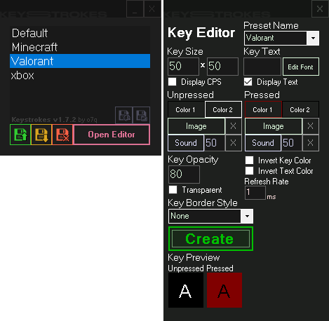

# [<b>>> Download Latest</b>](https://github.com/o7q/Keystrokes/releases/download/v1.4.0.0/Keystrokes.exe)
### Welcome! Keystrokes is a simple, highly customizable keystrokes visualizer. It allows the user to easily create and load multiple presets for different games, programs, and more.

---

---

# Overview
Keystrokes allows the user to create and customize key presets that are displayed on the screen.

---

# Usage
**TIP:** \
You can double-click on a key to edit its snapping settings.

## Tutorial

<b>Step 1.</b> Creating presets

- **1.1** Click the **Open Editor Button** to open the key editor
- **1.2** Select or a create a new preset (create one by typing a new name inside the preset selector)
- **1.3** Press the **Create Button** and press a key to create

<b>Step 2.</b> Managing presets

- **1.1** Select a preset in the preset selector
- **1.2** Click the first green button to load the selected preset
- **1.3** Click the second yellow button to unload all presets
- **1.4** Click the third red button to delete the selected preset

 

## Interface
- Preset Browser
    - **Load Preset Button** Loads the selected preset
    - **Unload Presets Button** Unloads all presets on the screen
    - **Delete Preset Button** Deletes the selected preset
    - **Open Editor Button** Opens the key editor
- Key Editor
    - **Preset Name Dropdown** The selected preset, any changes will be applied to this preset
    - **Key Size Textboxes** The width and height of the key
    - **Font Size Textbox** The font size of the key
    - **Show Text** Choose to show text on the key or not
    - **Key Unpressed**
        - **Color 1 Button** Opens the color picker for the background of the key
        - **Color 2 Button** Opens the color picker for the text of the key
        - **Image** Set the key background to an image
        - **Sound** Play a sound when the key is unpressed
    - **Key Pressed**
        - **Color 1 Button** Opens the color picker for the pressed background of the key
        - **Color 2 Button** Opens the color picker for the pressed text of the key
        - **Image** Set the key background to a different image when pressed
        - **Sound** Play a sound when the key is pressed
        - **Invert Key Color** Should the key invert its colors when pressed?
        - **Invert Text Color** Should the key text invert its colors when pressed?
    - **Key Opacity Textbox** The opacity of the key
     - **Transparent Background Checkbox** Option to make the key background completely transparent
    - **Display Counter** Displays a counter that displays how many times you clicked the key
    - **Key Border Style Dropdown** The border style of the key
- Key
    - **Double-Click** Double-click the key to show key settings
        - **Close Button** Closes the key
        - **Lock Button** Lock the key and prevent mouse interaction
        - **X and Y snapping options** Defines the key snapping grid related to the size of the key (100% means each grid unit is one key length)

---

**Keystrokes** \
Written in C# with .NET Framework 4.8